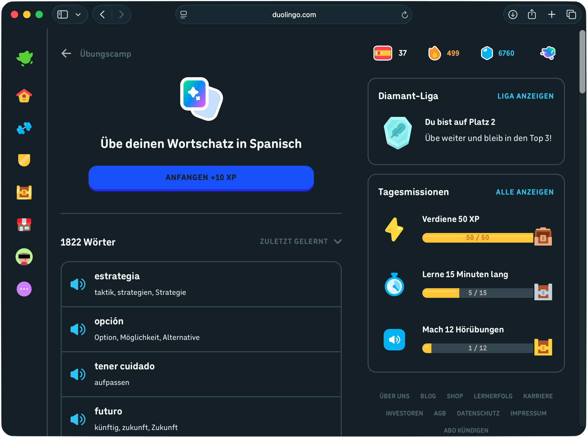
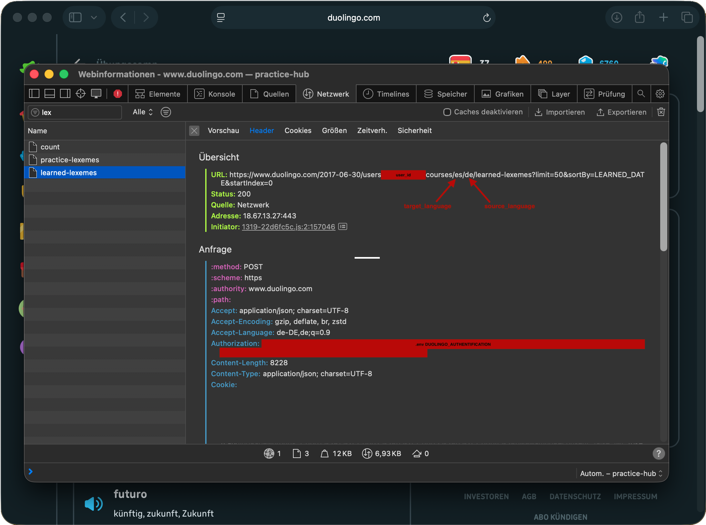
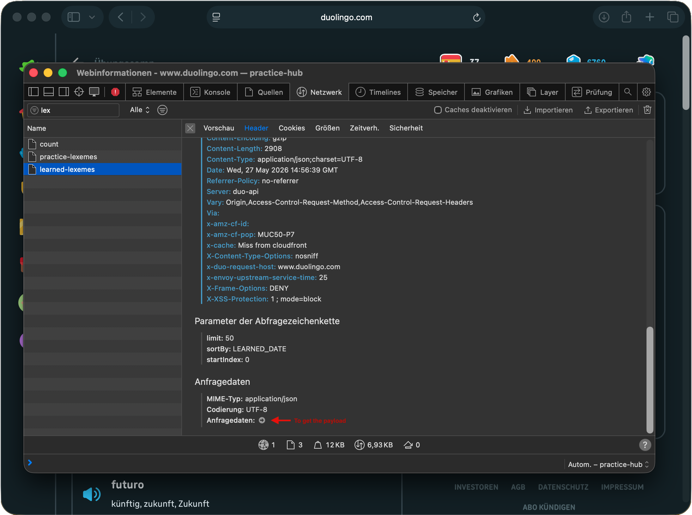
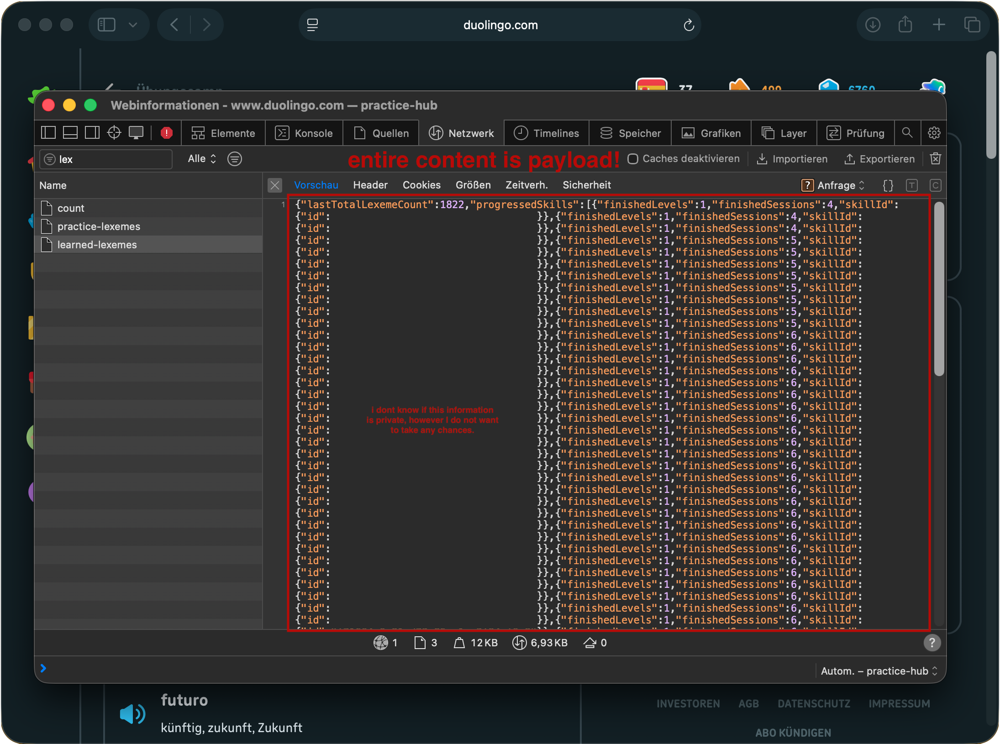

# LexHarvest 🦉⭐️

Personal vocabulary pipeline: extract words from Duolingo, enrich them via an LLM agent, and export ready-to-import Anki decks.

## Table of Contents

- [What it does](#what-it-does)
- [Setup](#setup)
- [Getting your Duolingo credentials](#getting-your-duolingo-credentials)
- [Run](#run)
- [Docker](#docker)
- [Exporting to Anki](#exporting-to-anki)
- [Customising the Anki card template](#customising-the-anki-card-template)
- [Contributing](#contributing)

---

## What it does

1. **Extract** — fetches your learned vocabulary from Duolingo via the unofficial API
2. **Enrich** — runs each word through a normalizer and dictionary lookup, then an LLM agent fills in gender, article, irregular flag, example sentence, and disambiguation notes
3. **Export** — generates a ready-to-import Anki deck (`.apkg`) with two card templates: word → translation and translation → word

Ambiguous words (e.g. *cuento* as noun vs. verb) are split into separate entries by the agent. Words not found in any dictionary are skipped and logged.

---

## Setup

**Requirements:** Python 3.12+, [uv](https://docs.astral.sh/uv/)

```sh
git clone <repo>
cd lexharvest
uv sync
```

Copy the example config files:

```sh
cp .env.example .env
cp config.toml.example config.toml
touch duolingo_payload.json
```

**Install pre-commit hooks** (runs ruff, mypy, and basic file checks on every commit):

```sh
uv run pre-commit install
```

---

## Getting your Duolingo credentials

Duolingo doesn't have a public API, so you need to grab your session credentials from the browser. This takes about 2 minutes.

### Step 1 — Open the vocabulary page

Go to [duolingo.com/practice-hub/words](https://www.duolingo.com/practice-hub/words). You should see your full word list.



---

### Step 2 — Open DevTools and go to the Network tab

Open your browser's developer tools (`F12` or `Cmd+Option+I` on Mac) and switch to the **Network** tab. Reload the page if no requests appear.

Filter by `lex` to narrow down the requests. Look for a request called **`learned-lexemes`** and click on it.



---

### Step 3 — Copy your credentials into `.env` and `config.toml`

In the **Headers** tab of the `learned-lexemes` request, find:

- **`Authorization`** — copy the full value (starts with `Bearer eyJ...`) and paste it into [`.env`](.env):
  ```
  DUOLINGO_AUTHENTIFICATION=Bearer eyJ...
  ```
- **URL** — the URL contains your `user_id`, `target_language`, and `source_language`:
  ```
  /users/{user_id}/courses/{target_language}/{source_language}/learned-lexemes
  ```
  Update these three values in [`config.toml`](config.toml).

---

### Step 4 — Copy the request payload into `duolingo_payload.json`

In Safari: scroll to the bottom of the **Headers** tab and click the arrow next to **Request data** to expand it — the entire content is the payload.

In Chrome/Firefox: switch to the **Payload** tab.



Copy the entire JSON body and paste it into `duolingo_payload.json`.



---

### Step 5 — Configure your LLM

Open [`config.toml`](config.toml) and set your provider and model:

```toml
[llm]
provider = "ollama"       # "ollama" | "openai" | "anthropic"
model = "gemma4:e2b"
# base_url = "http://localhost:11434/v1"   # ollama only
```

For cloud providers, add the corresponding API key to [`.env`](.env):

```
OPENAI_API_KEY=sk-...
# or
ANTHROPIC_API_KEY=sk-ant-...
```

---

### Step 6 — Install the spaCy language models

The pipeline uses spaCy models for **both** your target language (the one you're learning) and your source language (your native language) to normalise vocabulary. You need to install both manually — find the right models on the [spaCy models page](https://spacy.io/usage/models).

For example, for Spanish (target) and German (source):

```sh
uv run python -m spacy download es_core_news_sm
uv run python -m spacy download de_core_news_sm
```

Update [`config.toml`](config.toml) with the model names you chose:

```toml
[normalizer]
target_model = "es_core_news_sm"
source_model = "de_core_news_sm"
```

---

## Run

```sh
uv run python -m lexharvest
```

This will scrape your Duolingo vocabulary, normalize and enrich each word, and store the results in the local SQLite database (`lexharvest.db`). The pipeline is resumable — if it stops partway through, just run it again and it picks up where it left off.

**Flags:**

| Flag | Description |
|---|---|
| `--skip-scrape` | Skip fetching from Duolingo, process existing DB entries only |
| `--retry-errors` | Reset all errored entries to pending and reprocess them |
| `--concurrency N` | Number of concurrent LLM calls (default: 1) |
| `--dict-concurrency N` | Number of concurrent Wiktionary requests (default: 1) |
| `--export FILENAME` | Export completed entries to the given file path |
| `--export-format FORMAT` | Export format: `csv`, `anki-tsv`, or `anki-apkg` (default: `anki-apkg`) |
| `--anki-template PATH` | Path to the Anki template TOML (default: `anki_template.toml`) |

---

## Docker

If you don't want to install Python and uv locally, you can run LexHarvest in a Docker container. [Docker Desktop](https://www.docker.com/products/docker-desktop/) is the only requirement.

### Build the image

```sh
docker build -t lexharvest .
```

This installs all dependencies and downloads the default spaCy models (Spanish target, German source). The build takes a few minutes on first run — subsequent builds are cached.

**Custom language models:**

If you're learning a different language, pass your models as build args:

```sh
docker build -t lexharvest \
  --build-arg SOURCE_MODEL=fr_core_news_sm \
  --build-arg TARGET_MODEL=it_core_news_sm \
  .
```

Find the right model names on the [spaCy models page](https://spacy.io/usage/models).

### Run

Mount your project directory so the container can read your config and write results back to your filesystem:

```sh
docker run -v $(pwd):/app lexharvest
```

All CLI flags work exactly the same as the non-Docker version:

```sh
docker run -v $(pwd):/app lexharvest --skip-scrape --export exports/lexharvest.apkg
```

> The container reads `config.toml`, `.env`, and `duolingo_payload.json` from your mounted directory and writes `lexharvest.db` and exports back to the same location.

---

## Exporting to Anki

### Option A — Anki package (.apkg)

The recommended way. Generates a ready-to-import Anki deck with card templates and styling included:

```sh
uv run python -m lexharvest --skip-scrape --export exports/lexharvest.apkg
```

Import the `.apkg` file into Anki via **File → Import**. Re-importing after a new run will update existing cards without resetting your review progress, as long as the note IDs in [`anki_template.toml`](anki_template.toml) haven't changed.

> ⚠️ Do **not** change `model_id` or `deck_id` in [`anki_template.toml`](anki_template.toml) after the first import — Anki uses these to match your existing note type and deck. Changing them creates duplicates.

### Option B — Tab-separated file (.tsv)

Exports a tab-separated file you can import manually into an existing Anki note type:

```sh
uv run python -m lexharvest --skip-scrape --export exports/cards.tsv --export-format anki-tsv
```

When importing into Anki, make sure the field order in your note type matches the column order in the file. The columns are:

`ID · Word · Translation · Part of Speech · Gender · Article · Irregular · Example Sentence · Example Translation · Disambiguation`

---

## Customising the Anki card template

The card layout, styling, and field mappings are fully defined in [`anki_template.toml`](anki_template.toml) — no code changes needed. Key sections:

| Section | What it controls |
|---|---|
| `model_id` / `deck_id` | Stable Anki identifiers — set once, **never change** after first import |
| `columns` | Which DB fields to export |
| `fields` | Anki note field names (order matters) |
| `columns_to_fields_mapping` | Maps DB column names → Anki field names |
| `value_mapping` | Transforms field values (e.g. `masculine` → `m`) |
| `[source_to_target]` | Card template: translation → word (production) |
| `[target_to_source]` | Card template: word → translation (recognition) |
| `css` | Shared stylesheet for both card templates |

---

## Contributing

```sh
uv run pre-commit install   # install hooks (ruff, mypy, file checks)
uv run pytest               # run tests
```

Pull requests and issues are welcome.
